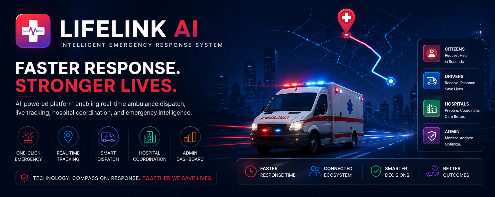

  

# LifeLink AI

### Intelligent Emergency Response & Healthcare Coordination Platform

LifeLink AI is a technology-driven emergency response platform designed to improve ambulance dispatch, emergency coordination, and healthcare readiness through real-time communication, location intelligence, and intelligent resource management.

The platform connects citizens, ambulance operators, hospitals, and emergency administrators through a unified digital ecosystem capable of supporting faster and more efficient emergency response operations.

---

## Project Status

🚧 Active Development & Research

LifeLink AI is currently in the prototype and architecture development phase.

This repository serves as the public documentation hub for the project's vision, architecture, system design, and future roadmap.

---

## The Problem

Emergency response systems often face significant operational challenges:

- Delayed ambulance dispatch
- Lack of real-time visibility
- Poor communication between stakeholders
- Limited hospital preparedness
- Inefficient emergency resource allocation
- Absence of intelligent coordination mechanisms

These challenges can directly impact patient outcomes during critical situations.

---

## Our Solution

LifeLink AI provides a unified emergency response ecosystem designed to:

- Enable one-click emergency activation
- Dispatch ambulances efficiently
- Provide live ambulance tracking
- Improve communication between patients and responders
- Enhance hospital preparedness
- Support emergency administrators with operational visibility

---

## Core Features

### Emergency Activation

Rapid emergency request generation with minimal user interaction.

### Real-Time Ambulance Dispatch

Instant communication between emergency requests and available ambulance operators.

### Live Location Tracking

Monitor ambulance movement and estimated arrival time.

### Hospital Coordination

Improve preparedness by notifying healthcare facilities of incoming emergencies.

### Emergency Monitoring

Provide operational visibility through administrative dashboards.

### Intelligent Emergency Infrastructure

Create a foundation for future AI-powered healthcare coordination.

---

## System Architecture

LifeLink AI follows a modular emergency response architecture.

### Citizen Layer

- Emergency Requests
- Location Detection
- Status Monitoring

### Coordination Layer

- Request Processing
- Driver Assignment
- Event Management

### Response Layer

- Ambulance Operators
- Hospital Systems
- Emergency Administrators

### Intelligence Layer (Future)

- AI Dispatch
- Severity Analysis
- Predictive Emergency Analytics

---

## Technology Stack

### Frontend

- HTML5
- CSS3
- JavaScript

### Backend

- Python
- Flask

### Real-Time Communication

- Socket.IO

### Location Services

- Leaflet Maps

### Database

- SQLite

### Version Control

- Git
- GitHub

---

## Documentation

| Document | Description |
|-----------|------------|
| vision.md | Project vision and mission |
| architecture.md | System architecture |
| roadmap.md | Development roadmap |
| system-design.md | Detailed system design |
| technology-stack.md | Technology architecture |

---

## Development Roadmap

### Phase 1

Prototype Development

### Phase 2

Platform Stabilization

### Phase 3

Intelligent Emergency Routing

### Phase 4

Hospital Intelligence Layer

### Phase 5

Citizen Health Profiles

### Phase 6

AI Emergency Assistant

### Phase 7

Smart Emergency Network

---

## Future Directions

LifeLink AI is designed to evolve toward:

- AI-Based Ambulance Allocation
- Emergency Severity Prediction
- Hospital Capacity Intelligence
- Predictive Emergency Analytics
- Mobile Applications
- Multi-City Deployment
- Healthcare Intelligence Platforms

---

## Research & Innovation Areas

- Healthcare Technology
- Emergency Response Systems
- Real-Time Communication
- Location Intelligence
- Artificial Intelligence
- Human-Centered Systems
- Intelligent Resource Allocation

---

## Author

### Vishwajeet Nande

Founder, Inovexia AI Technologies

Research Interests:

Artificial Intelligence • Intelligent Systems • Healthcare Technology • Decision Intelligence • Human-AI Collaboration

---

## Disclaimer

LifeLink AI is an educational, research, and development initiative.

The current implementation is a prototype and should not be interpreted as a production-ready emergency healthcare platform.
